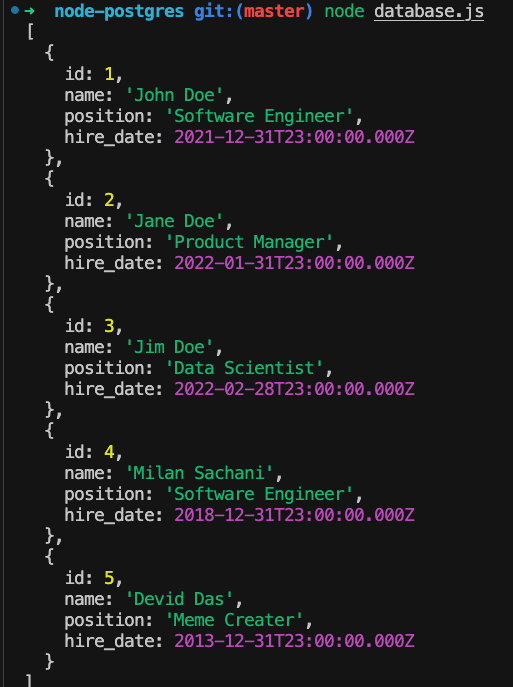

## Node.js & PostgreSQL APP

<h3> This application demonstrates how to connect to a PostgreSQL database from a Node.js application using the pg library. </h3>

## Requirements

- Node.js installed on your machine.
- PostgreSQL installed on your machine or accessible on a network.
- A PostgreSQL database to connect to.
  PGAdmin installed (optional for GUI database management).

## How to Setup!

## Database Configuration

- Open PGAdmin and connect to your PostgreSQL server.
- Create a new database or use an existing one.
- Create a new table employees with the following columns: id (serial), name (varchar), position (varchar), hire_date (date).
- Insert some test data into the employees table.

## Application Configuration

## Clone this repository to your local machine.

```
git clone https://github.com/Milan-960/Node-Postgres.git
```

- Navigate into the project directory and run npm install to install dependencies.
- Create a .env file in the root directory of the project and add your PostgreSQL connection details:

```
PGHOST='localhost'
PGUSER='your_username'
PGDATABASE='your_database'
PGPASSWORD='your_password'
PGPORT=5432
```

- Replace 'your_username', 'your_database', and 'your_password' with your actual PostgreSQL username, database name, and password.

## Run the Node.js application with the command `node database.js`

- Your Node.js application will connect to the PostgreSQL database and retrieve all records from the employees table.

## Usage

- This application currently retrieves and logs all records from the employees table in the configured PostgreSQL database. You can modify database.js to execute different SQL queries or to build a web API, etc.

## Contributing

- This is a simple demo application and is not actively maintained. You are welcome to fork and modify it for your own purposes!

## Console!


&nbsp;
